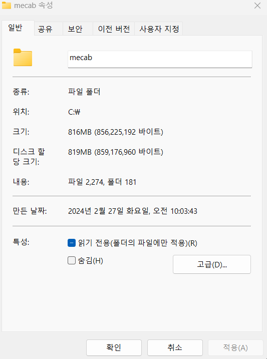
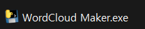
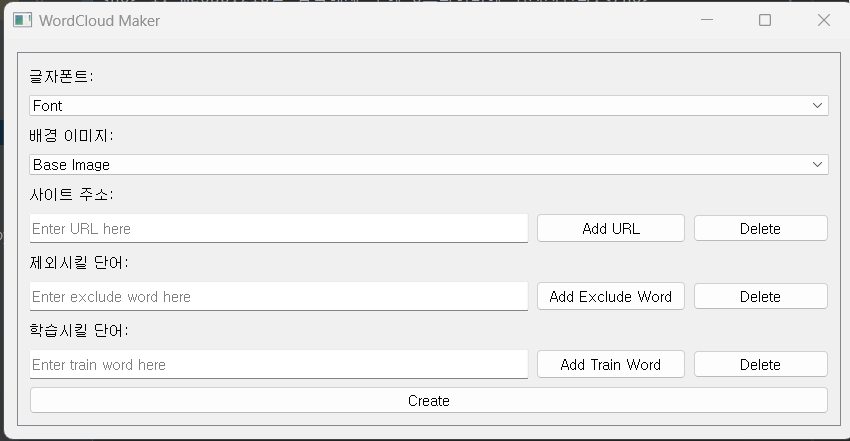
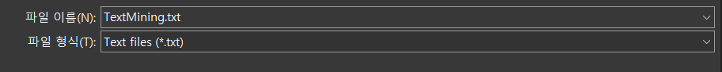
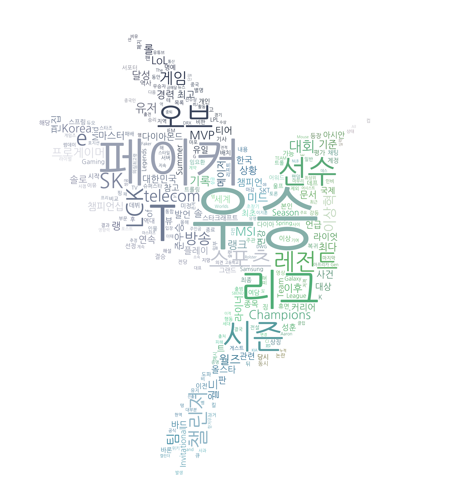
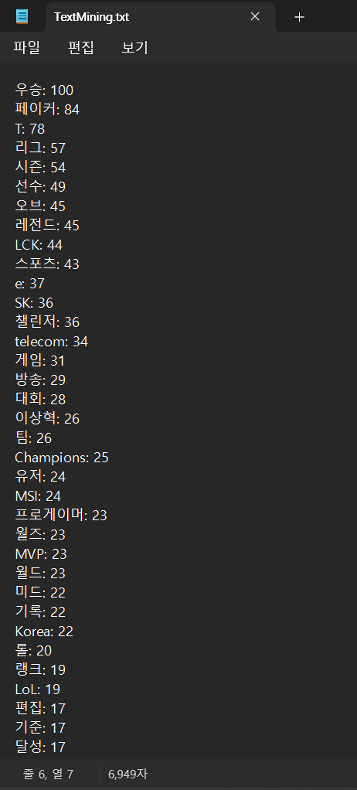

<h1>Wordcloud Maker</h1>
블로그 상위 노출을 위한 키워드 추출기 (2가지 기능 존재)
 
1. Text Mining
 
2. Word Cloud

---

<h3> 1. mecab.zip을 압축해제 후에 c드라이버에 위치시킨다.</h3>
 

<h3> 2. mecab폴더에서 WoedCloud Maker.exe를 실행시킵니다. </h3>
 

<h3> 3. 옵션 설정</h3>
 

<h5>
설정방법

- 글자 폰트와 원하는 워드클라우드의 모양을 선택합니다.
- 원하는 사이트들의 주소를 입력합니다.
- 제외시키고 싶은 단어를 입력합니다.
- 한글 구분이 원할하지 않아 인식을 못할경우 학습시킬 단어를 입력받으면 dictionary에 추가됩니다.
</h5>

<h3> 4. 파일 저장</h3>
 

<h5>
원하는 장소에 저장합니다. 이때 txt file의 이름은 변경이 가능하지만
워드클라우드 이미지의 이름은 WordCloud.png로 고정됩니다.
</h5>

<h3> 5. 결과물</h3>

<h5>
원하는 장소에 저장합니다. 이때 txt file의 이름은 변경이 가능하지만
워드클라우드 이미지의 이름은 WordCloud.png로 고정됩니다.
</h5>
 
 

----

